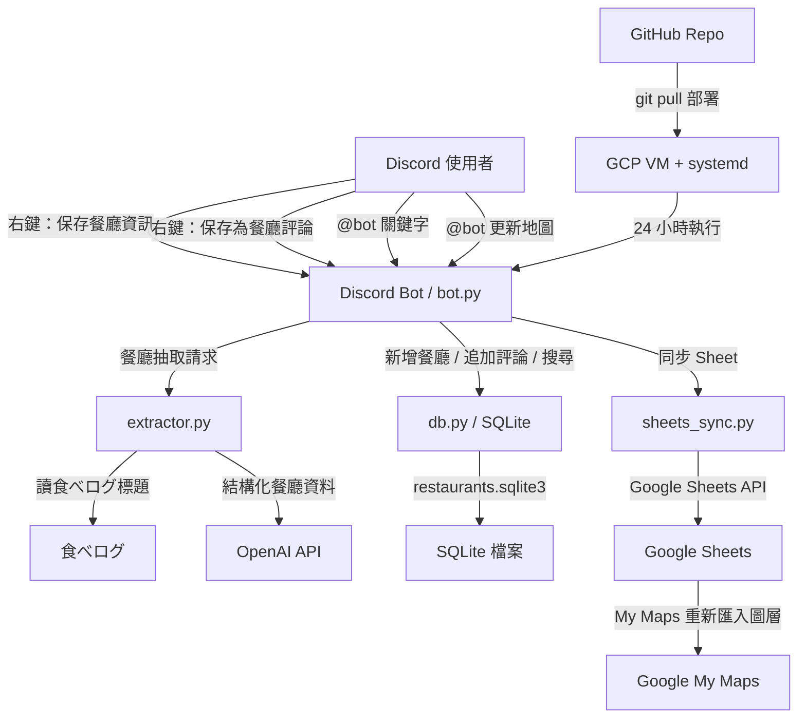
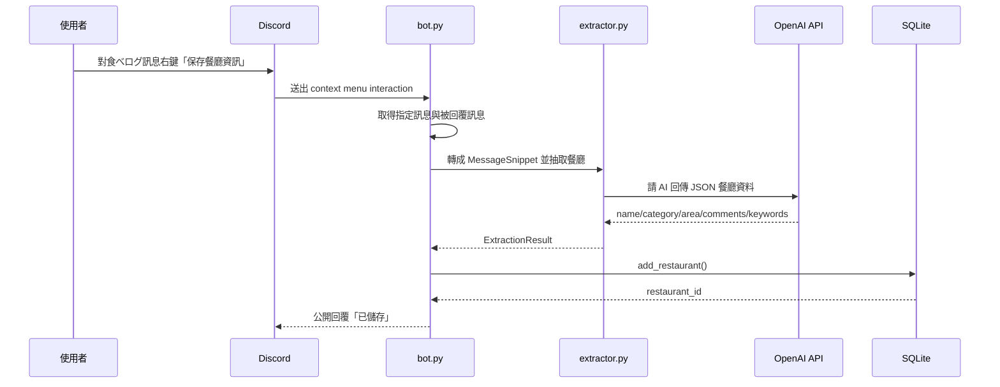
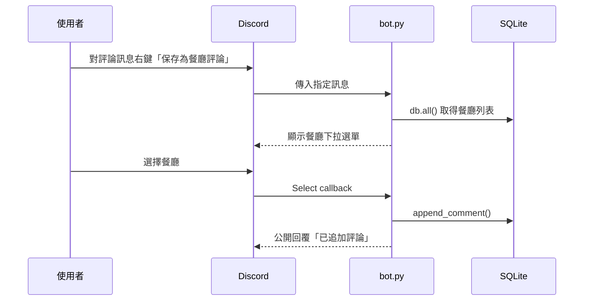
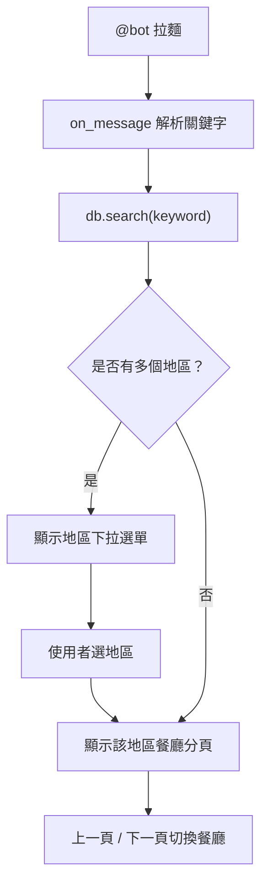
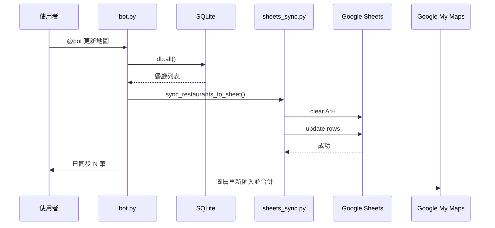
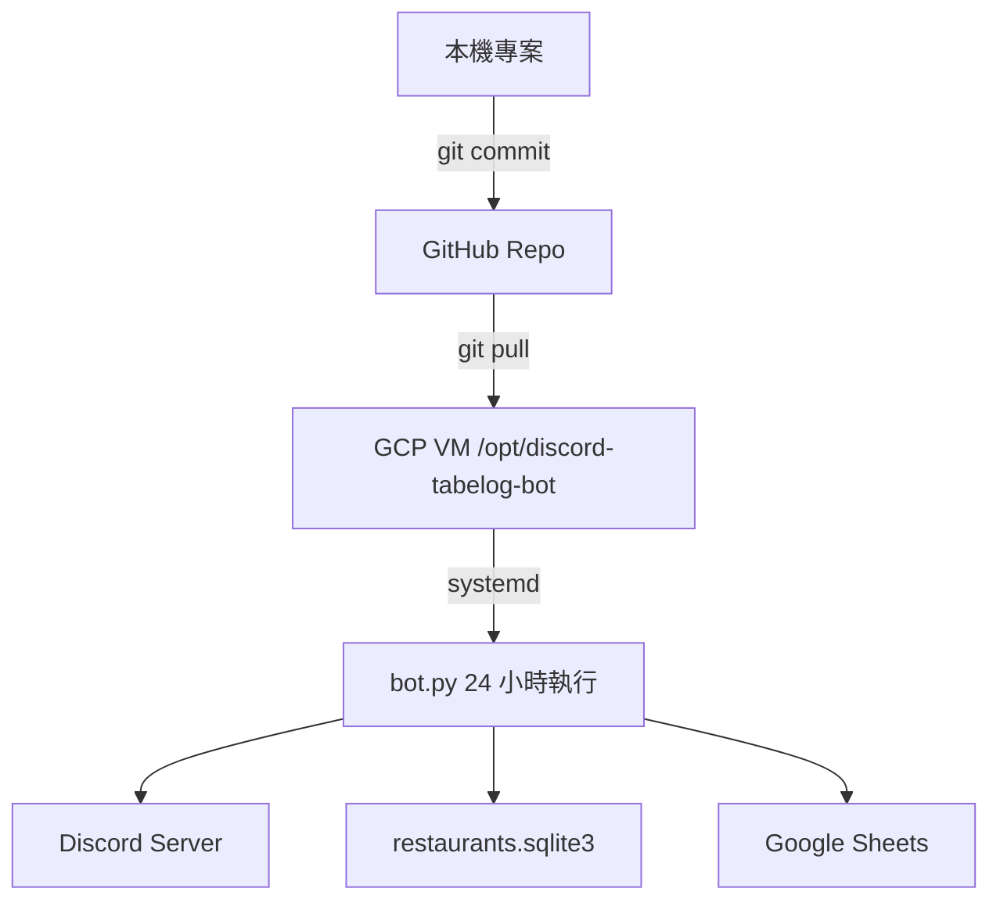

# Discord 食べログ Bot 專案流程與學習筆記

## 專案目標

這個專案是一個 Discord 餐廳記憶 bot。它讓使用者在 Discord 裡保存餐廳資訊、追加評論、搜尋餐廳，並把資料同步到 Google Sheets，最後由 Google My Maps 匯入成共享美食地圖。

核心概念：

- Discord 是使用者介面。
- SQLite 是 bot 的主要資料庫。
- OpenAI 負責從食べログ連結與訊息中抽取餐廳資訊。
- Google Sheets 是 My Maps 的資料來源。
- GCP VM + systemd 讓 bot 24 小時執行。

## 整體架構圖



## 使用者操作流程

### 保存餐廳



### 保存評論



### 搜尋餐廳



### 更新地圖



## 檔案責任分工

| 檔案 | 責任 |
|---|---|
| `bot.py` | Discord 事件、右鍵選單、slash command、搜尋 UI、Google Sheet 同步觸發 |
| `db.py` | SQLite 資料表、餐廳新增、評論追加、搜尋、日文搜尋正規化 |
| `extractor.py` | 食べログ網址偵測、抓頁面標題、OpenAI 餐廳資料抽取 |
| `sheets_sync.py` | 使用 service account 寫入 Google Sheets |
| `.env.example` | 環境變數範本，不含真正密鑰 |
| `deploy/systemd/discord-tabelog-bot.service` | GCP VM 上 systemd 服務設定 |

## 資料模型

SQLite 目前主要只有一張表：`restaurants`。

重要欄位：

- `id`：餐廳 ID，使用者追加評論時可以用。
- `name`：餐廳名稱。
- `category`：分類，例如拉麵、燒肉、咖啡。
- `area`：地區，例如府中、池袋。
- `tabelog_url`：食べログ連結。
- `google_maps_url`：Google Maps 搜尋連結。
- `comments`：評論文字，目前用追加文字方式累積。
- `keywords_json`：搜尋關鍵字，以 JSON 字串存放。

目前 comments 是存在同一欄位裡，這很簡單，但未來如果要做評論作者、時間、刪除單則評論，建議拆成 `restaurant_comments` 表。

## 你目前已經學到的技能

- Discord bot 基本架構。
- slash command 和 context menu。
- Python async / await。
- SQLite 基本 CRUD。
- OpenAI API 結構化抽取。
- Google Sheets API service account。
- GCP VM + systemd 長時間部署。
- Git / GitHub 基本版控。
- `.env` 管理機密設定。

## 建議補強的知識

### 1. Python async / await

Discord bot 是事件驅動程式。`async def` 代表這個函式可能會等待網路操作，例如 Discord API、OpenAI API、Google API。

建議理解：

- event loop 是什麼
- `await` 為什麼不等於卡住整個程式
- callback 的概念

### 2. 資料庫設計

目前用一張表即可，但資料變多後你會遇到：

- 餐廳與評論應該分表
- 如何避免重複餐廳
- 如何修改或刪除單筆評論
- 索引如何提升搜尋速度

下一步可以練習：

```text
restaurants
restaurant_comments
restaurant_tags
```

### 3. API 權限與憑證

你已經遇過幾個真實問題：

- OpenAI quota 不足
- Google Sheets API 未啟用
- service account 沒有 Sheet 權限
- Sheet ID 大小寫錯誤
- JSON 金鑰不能上 GitHub

這些是後端工程很重要的基礎。

### 4. 部署與維運

你已經用 systemd 讓 bot 長跑。接下來可以學：

- `journalctl` 看 log
- `systemctl restart/status`
- VM 防火牆與 SSH
- 如何更新 GitHub 後在 VM `git pull`
- 如何備份 SQLite

### 5. 產品設計

這個 bot 的功能是從真實使用情境長出來的：

- 右鍵保存比讀最近 N 則更準。
- 評論手動追加比 AI 判斷更可控。
- 搜尋先選地區比一次列全部更不洗版。
- My Maps 不是即時同步，所以 Google Sheets 只是資料橋樑。

這是很好的產品迭代思維。

## 目前架構的限制

- My Maps 不會完全自動讀取 Sheet 更新，需要手動重新匯入圖層。
- comments 是單一文字欄位，不利於管理每則評論。
- SQLite 在單一 VM 上很簡單，但多人高頻使用時不如 PostgreSQL。
- OpenAI 抽取店名偶爾會出錯，尤其日文 OCR 或食べログ標題複雜時。
- `@bot 更新地圖` 只更新 Sheet，不直接控制 My Maps。

## 可做的下一版

1. 新增 `/delete_restaurant` 刪除錯誤餐廳。
2. 新增 `/edit_restaurant` 修改店名、分類、地區。
3. 把評論拆成獨立資料表。
4. 加入備份指令，匯出 SQLite 或同步到 Google Drive。
5. 做一個 Leaflet 小網頁，真正即時讀 Sheet 或 API 顯示地圖。
6. 加入圖片 OCR 或圖片描述能力，讓只有照片的訊息也能輔助保存。

## GitHub 與 VM 部署流程



常用 VM 指令：

```bash
sudo systemctl status discord-tabelog-bot
sudo journalctl -u discord-tabelog-bot -f
sudo systemctl restart discord-tabelog-bot
```

更新 VM 程式：

```bash
cd /opt/discord-tabelog-bot
sudo -u discordbot git pull
sudo -u discordbot .venv/bin/pip install -r requirements.txt
sudo systemctl restart discord-tabelog-bot
```

## 學習自評

如果你能回答下面問題，代表你真的理解專案：

- 為什麼 `.env` 不可以上 GitHub？
- 為什麼 service account 要加入 Google Sheet 共用？
- 為什麼 bot 在 VM 上需要 systemd？
- 為什麼 `@bot 拉麵` 需要 Message Content Intent？
- SQLite 的 `restaurants.sqlite3` 在本機和 VM 是不是同一份？
- 為什麼 My Maps 不會自動即時更新？
- 為什麼片假名 `カツ` 和平假名 `かつ` 原本搜不到？

你目前不足的不是「不會寫程式」，而是還在建立後端工程的整體地圖。這個專案剛好把 API、資料庫、部署、權限、產品流程都串起來，是很適合拿來當學習作品集的題目。
